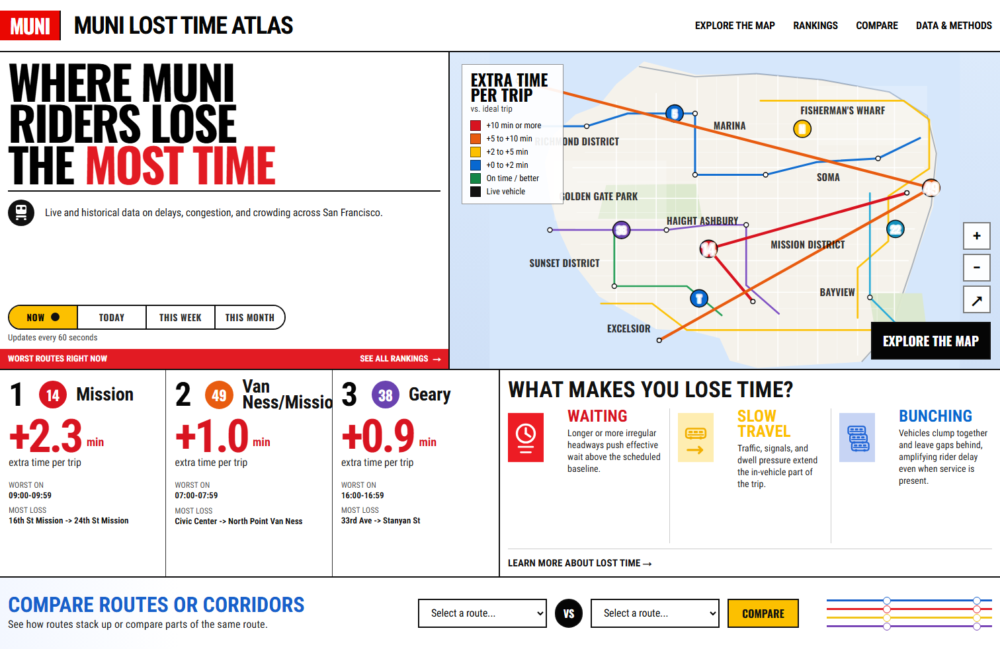

# Muni Lost Time Atlas

Muni Lost Time Atlas is a transit analytics project that measures where San Francisco bus riders lose time, using GTFS schedules and historical stop-observation archives from `511`. The system ingests raw transit data, models route-level and segment-level delay metrics in `Postgres` + `dbt`, serves those analytics through a thin `FastAPI` backend, and presents them in a public-facing `Next.js` application.



## What it does

- ingests active and historical `511` GTFS transit feeds plus historic `stop_observations` archives
- normalizes raw schedule and observation data into `staging`, `canonical`, `marts`, and `serving` layers
- computes rider-facing metrics such as waiting loss, in-vehicle delay, route rankings, and worst segments
- materializes geospatial route, segment, and stop layers in `PostGIS`
- exposes analytics through typed `FastAPI` endpoints for rankings, route summaries, comparisons, and map reads
- renders the published data in a `Next.js` interface with rankings, compare, map, and methodology views

## Why it matters

Public transit reliability is often discussed in operational terms, but riders experience it as lost time. This project reframes raw schedule and observation data into rider-facing metrics that can support service analysis, communication, and planning.

## Stack

- data ingestion and archive handling: `Python`
- transformation and modeling: `SQL` + `dbt`
- database and spatial layers: `Postgres` + `PostGIS`
- API: `FastAPI` + `Pydantic`
- frontend: `Next.js` + `TypeScript`
- testing: `unittest`, `Vitest`, and `Playwright`

## Architecture

`511 feeds -> Python acquisition/loaders -> Postgres raw tables -> dbt staging/canonical/marts -> FastAPI -> Next.js`

## Analytical focus

The project translates transit operations into rider-facing time loss:

- extra waiting time caused by irregular headways
- extra in-vehicle time caused by slower-than-baseline trips
- route-level, time-window, and segment-level summaries for operational diagnosis

For metric definitions and assumptions, see `planning_docs/02_methodology.md`.

## Current status

Implemented today:

- active and historical `511` GTFS acquisition plus archive-backed stop-observation ingest
- staged, canonical, mart, and serving models in the in-repo `dbt` project
- rider time-loss metrics for route, direction, hour, segment, and stop-wait views
- `FastAPI` endpoints for rankings, route summaries, segments, comparisons, stop waits, and map layers
- a `Next.js` frontend with homepage, compare, map, route detail, and methodology pages
- unit, integration, and frontend test coverage

Current limitations:

- the project is local-first and not yet deployed as a public live site
- realtime vehicle ingestion remains deferred
- the real-data cutover is intentionally bounded to validated historical slices rather than a continuously refreshed warehouse

Production deployment artifacts:

- `docker-compose.coolify.yml`
- `frontend/Dockerfile`
- `api/Dockerfile`
- `publisher/Dockerfile`
- `planning_docs/runbooks/production_hetzner_coolify_rollout.md`

## Quick start

Create a local virtual environment:

```powershell
python -m venv .venv
```

Install the Python project:

```powershell
.\.venv\Scripts\python.exe -m pip install -e . uvicorn
```

Start the local database:

```powershell
Copy-Item .env.example .env
docker compose up -d db
```

Build the historical metrics graph:

```powershell
.\.venv\Scripts\python.exe .\pipeline\src\muni_lta_pipeline\core_metrics.py
```

Run the API:

```powershell
.\.venv\Scripts\python.exe -m uvicorn muni_lta_api.app:create_app --factory --reload
```

Run the frontend:

```powershell
cd frontend
npm install
npm run dev
```

## Repository layout

- `frontend/`
  - `Next.js + TypeScript` application
- `api/`
  - `FastAPI` service for the historical/static analytics surface
- `pipeline/`
  - ingestion, transformations, and shared data-platform code
- `dbt/`
  - staged, canonical, mart, and serving models plus dbt-native tests
- `tests/`
  - repository-level unit and integration tests
- `fixtures/`
  - GTFS, observations, API, and geospatial fixture data
- `planning_docs/`
  - planning notes, methodology, and implementation slice docs

## Development workflow

This repository was built in small, testable implementation slices. For internal planning context, start with:

1. `planning_docs/00_project_brief.md`
2. `planning_docs/01_product_experience.md`
3. `planning_docs/02_methodology.md`
4. the assigned slice doc in `planning_docs/slices/`

Additional contract docs:

- `planning_docs/04_architecture.md` for the system shape
- `planning_docs/05_api_contract.md` for API work
- `planning_docs/06_data_model.md` for data/platform work
- `planning_docs/09_decisions.md` for prior decisions

## Local database bootstrap

The MVP uses a local Docker Compose service for development database work.

- create a local `.env` first:
  - `Copy-Item .env.example .env`
  - open `.env` and set a local-only `POSTGRES_PASSWORD`
  - if your local DB was already initialized with the old inline password, run `docker compose down -v` once so Postgres reinitializes with the `.env` values
- service: `db`
- image: `postgis/postgis:16-3.4`
- database/user/password come from local `.env`

Common commands:

```powershell
docker compose up -d db
docker compose ps
docker compose down
```

Repeatable smoke test:

```powershell
powershell -ExecutionPolicy Bypass -File .\tests\integration\db_smoke_test.ps1
```

The smoke test expects a local `.env`, starts the DB if needed, confirms the `db` service is running, and retries one simple `psql` query until it returns the database name, user, and `PostGIS` version.

## Active 511 GTFS acquisition

The project now has a separate acquisition step for the active operator-specific Muni GTFS feed from `511`.

- set `TRANSIT_511_API_KEY` in the repo-root `.env`
- the fetcher targets `operator_id=SF`
- successful downloads are archived locally as:
  - a timestamped `.zip`
  - a neighboring `.json` provenance/validation record
- default artifact location:
  - `artifacts/acquisitions/511/operator_active/`

Example command with the bundled Python runtime:

```powershell
& 'C:\Users\ahadb\.cache\codex-runtimes\codex-primary-runtime\dependencies\python\python.exe' .\pipeline\src\muni_lta_pipeline\active_gtfs_fetch.py
```

Optional live verification test:

```powershell
& 'C:\Users\ahadb\.cache\codex-runtimes\codex-primary-runtime\dependencies\python\python.exe' -m unittest tests.integration.test_511_active_gtfs_fetch -v
```

## Historic 511 regional GTFS acquisition

The project now also has a separate acquisition step for monthly historic `511` regional GTFS feeds used by retrospective analysis.

- set `TRANSIT_511_API_KEY` in the repo-root `.env`
- the fetcher targets `operator_id=RG`
- pass `--historic-month YYYY-MM`
- use `--with-stop-observations` to request the historic `-so` variant with `stop_observations.txt`
- successful downloads are archived locally as:
  - a timestamped `.zip`
  - a neighboring `.json` provenance/validation record
- default artifact location:
  - `artifacts/acquisitions/511/regional_historic/`

Example commands with the bundled Python runtime:

```powershell
& 'C:\Users\ahadb\.cache\codex-runtimes\codex-primary-runtime\dependencies\python\python.exe' .\pipeline\src\muni_lta_pipeline\historic_rg_feed_fetch.py --historic-month 2023-02
& 'C:\Users\ahadb\.cache\codex-runtimes\codex-primary-runtime\dependencies\python\python.exe' .\pipeline\src\muni_lta_pipeline\historic_rg_feed_fetch.py --historic-month 2023-02 --with-stop-observations
```

Optional live verification test:

```powershell
& 'C:\Users\ahadb\.cache\codex-runtimes\codex-primary-runtime\dependencies\python\python.exe' -m unittest tests.integration.test_511_historic_rg_feed_fetch -v
```

## Canonical scheduled models

The project now has a first scheduled-model materialization layer on top of the raw GTFS fixture.

- uses `staging` for typed GTFS normalization
- uses `canonical` for stable scheduled entities
- expands service dates from `calendar.txt` and `calendar_dates.txt`
- keeps service-day-relative times as seconds for downstream calculations

Example command:

```powershell
& 'C:\Users\ahadb\.cache\codex-runtimes\codex-primary-runtime\dependencies\python\python.exe' .\pipeline\src\muni_lta_pipeline\canonical_scheduled_models.py
```

## Historic stop observations fixture ingest

The project now has a fixture-driven raw ingest path for historical `stop_observations`.

- loads `fixtures/stop_observations/regional_rg_minimal/stop_observations.txt`
- creates and populates `raw.stop_observations`
- preserves source-facing observation fields for `service_date`, `trip_id`, `stop_id`, `stop_sequence`, and `observed_arrival_time`
- derives a typed `observed_arrival_ts` for later scheduled/observed reconciliation work

Example command:

```powershell
& 'C:\Users\ahadb\.cache\codex-runtimes\codex-primary-runtime\dependencies\python\python.exe' .\pipeline\src\muni_lta_pipeline\historic_stop_observations_fixture_ingest.py
```

## Real historic stop observations archive ingest

The project now also has a real archive-backed raw ingest path for historic `RG` `stop_observations`.

- reads the `.json` sidecar and `.zip` artifact produced by `historic_rg_feed_fetch.py --with-stop-observations`
- loads real archive rows into `raw.stop_observations`
- maps source `to_stop_id` into raw `stop_id`
- parses compact `service_date` values and derives a typed `observed_arrival_ts` from service-day local times
- uses `archive_...` snapshot labels so real loads remain distinguishable from fixture loads

Important assumption:
- the loader treats `stop_observations.txt` as an arrival-event file and currently narrows source `to_stop_id` into raw `stop_id`
- that mapping is a documented repo assumption used for conservative exact arrival-event joins; it should not be mistaken for a fully formalized public-schema guarantee from 511

Example command:

```powershell
& 'C:\Users\ahadb\.cache\codex-runtimes\codex-primary-runtime\dependencies\python\python.exe' .\pipeline\src\muni_lta_pipeline\historic_stop_observations_archive_ingest.py --metadata-path .\artifacts\acquisitions\511\regional_historic\511_regional_historic_RG_202302_with_so_20260508T223557Z.json --max-rows 250
```

## Scheduled observed join

The project now has a first canonical scheduled/observed stop-event join for validated happy-path work.

- `canonical.observed_stop_events` keeps only exact matches on `service_date`, `trip_id`, `stop_sequence`, and `stop_id`
- `canonical.observed_stop_event_join_audit` surfaces unmatched or mismatch cases per raw observation row
- `canonical.observed_stop_event_join_summary` exposes grouped counts by observed snapshot and join status
- scheduled timestamps are materialized alongside observed timestamps so later waiting/runtime calculations can compare them directly

Example command:

```powershell
& 'C:\Users\ahadb\.cache\codex-runtimes\codex-primary-runtime\dependencies\python\python.exe' .\pipeline\src\muni_lta_pipeline\canonical_observed_stop_events.py
```

## Core metrics

The project now also has the first route-summary marts for rider time loss.

- `marts.route_window_summary`
- `marts.route_direction_summary`
- `marts.route_hour_summary`
- matched observation coverage remains separate from unmatched audit counts

Example command:

```powershell
& 'C:\Users\ahadb\.cache\codex-runtimes\codex-primary-runtime\dependencies\python\python.exe' .\pipeline\src\muni_lta_pipeline\core_metrics.py
```

## dbt transformation project

The proven transformation graph now lives in a real dbt project under `dbt/`.

- `raw` sources stay outside dbt and are still loaded by the Python fixture/archive loaders
- dbt owns `staging`, `canonical`, and `marts`
- the existing Python transformation entrypoints now call dbt build selectors instead of raw SQL files
- dbt-native tests cover core unique keys, not-null keys, and route/stop/trip relationships

To install the dbt runtime into the local venv:

```powershell
.\.venv\Scripts\python.exe -m pip install -e .
```

To run the full staged/canonical/mart graph against the local Postgres instance:

```powershell
.\.venv\Scripts\python.exe .\pipeline\src\muni_lta_pipeline\core_metrics.py
```

## Real dataset cutover

The project now has a bounded real historical cutover path for the app-facing marts, API, and frontend.

- use `pipeline/src/muni_lta_pipeline/real_dataset_cutover.py`
- the cutover now derives an `SF`-only historic archive from the fetched `RG -so` source archive before loading raw tables and rebuilding dbt
- the validated bounded cut in this bundle is:
  - historic month `2023-02`
  - regional archive scope `RG -so`
  - in-archive agency filter `SF`
- the cutover entrypoint:
  - fetches active `SF` GTFS and the bounded historic `RG -so` archive
  - derives an `SF`-only historic archive snapshot under `artifacts/acquisitions/511/regional_historic_sf/`
  - loads the derived `SF`-only GTFS archive into `raw.gtfs_*`
  - loads the derived `SF`-only historic observations into `raw.stop_observations`
  - rebuilds dbt against the `regional_historic_sf` snapshot
  - writes a provenance manifest to `artifacts/cutovers/b6a_real_dataset_cutover_bundle/latest.json`
  - reuses the existing raw GTFS, raw observations, and overlay snapshots by default when the target snapshot labels are already present
  - accepts `--force-raw-reload` to rebuild raw inputs intentionally and `--skip-dbt` to prepare artifacts/raw data without rerunning dbt

Run it with:

```powershell
$env:PYTHONPATH='C:\Users\ahadb\Documents\New project 3\pipeline\src'
.\.venv\Scripts\python.exe -m muni_lta_pipeline.real_dataset_cutover --historic-month 2023-02 --historic-agency-id SF
```

To rebuild the validated archived snapshot exactly, reuse the recorded sidecars:

```powershell
$env:PYTHONPATH='C:\Users\ahadb\Documents\New project 3\pipeline\src'
.\.venv\Scripts\python.exe -m muni_lta_pipeline.real_dataset_cutover --historic-month 2023-02 --historic-agency-id SF --active-metadata-path 'C:\Users\ahadb\Documents\New project 3\artifacts\acquisitions\511\operator_active\511_operator_active_SF_20260520T201312Z.json' --historic-metadata-path 'C:\Users\ahadb\Documents\New project 3\artifacts\acquisitions\511\regional_historic\511_regional_historic_RG_202302_with_so_20260520T201335Z.json'
```
