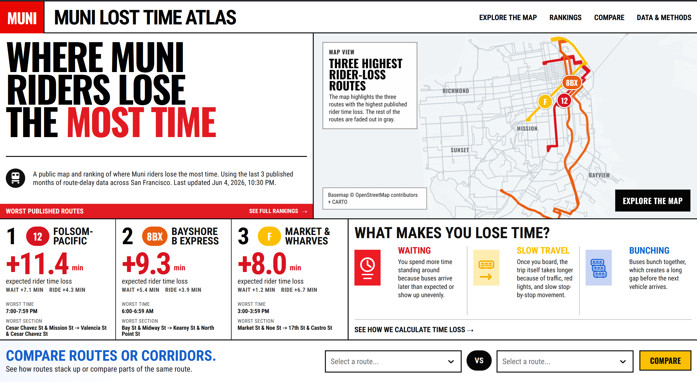

# Muni Lost Time Atlas

Muni Lost Time Atlas is a transit reliability project for San Francisco. It turns GTFS schedules and historical stop-observation archives into a public-facing map and ranking of where riders lose the most time.

Live site: [munitimelossatlas.com](https://munitimelossatlas.com/)

Twitter thread: [https://x.com/ahadbashir_/status/2063756240287920148](https://x.com/ahadbashir_/status/2063756240287920148)

Instead of describing reliability only in operational terms, the project measures transit from the rider's perspective:

- extra waiting caused by irregular headways
- extra in-vehicle time caused by slower-than-scheduled trips
- route, stop, segment, and map views that make the burden visible



## What the app does

The web app answers a few simple questions:

- Which routes are costing riders the most time right now?
- Is that burden mostly waiting or slow travel?
- Where on a route does the delay concentrate?
- Which stop has the worst waiting loss?
- How do two routes or corridors compare?

The current product surface includes:

- a live public site at [munitimelossatlas.com](https://munitimelossatlas.com/)
- a homepage with top rider-loss routes
- a citywide route map
- a rankings page
- route detail pages with corridor evidence and stop-wait hotspots
- a compare experience
- a public methodology page

## What the pipeline does

At a high level:

`511 archives -> Python loaders -> Postgres raw tables -> dbt models -> FastAPI -> Next.js`

More concretely:

1. Python ingestion scripts load active and historical `511` GTFS archives plus historical stop observations.
2. Raw data lands in `Postgres` / `PostGIS`.
3. `dbt` transforms that raw data through four layers:
   - `staging`: typed, filtered snapshot inputs
   - `canonical`: trustworthy scheduled and observed event tables
   - `marts`: rider-facing metrics like waiting loss, in-vehicle loss, route rankings, and segment metrics
   - `serving`: API-ready route, stop, and segment layers with geometry
4. A thin `FastAPI` service reads those final tables.
5. A `Next.js` frontend renders the public experience.

## How the core metric works

The main route-level number shown across the site is:

`expected rider time loss = waiting loss + in-vehicle loss`

- **Waiting loss** measures how much worse the observed headway pattern is than the scheduled one.
- **In-vehicle loss** measures how much longer matched trips take than schedule.

The route summary is built in [dbt/models/marts/core_metrics/route_window_summary.sql](C:/Users/ahadb/Documents/New%20project%203/dbt/models/marts/core_metrics/route_window_summary.sql).

For a fuller explanation, see:

- [planning_docs/02_methodology.md](C:/Users/ahadb/Documents/New%20project%203/planning_docs/02_methodology.md)
- [frontend/app/methodology/page.tsx](C:/Users/ahadb/Documents/New%20project%203/frontend/app/methodology/page.tsx)

## Why this project is interesting

Transit reliability data often exists, but it is usually difficult to interpret as rider burden. This project tries to bridge that gap by combining:

- archival schedule data
- archival observed stop-event data
- reproducible SQL modeling in `dbt`
- public-facing cartography and rankings

That makes it useful as:

- a civic data product
- an operations-analysis tool
- a transit storytelling project
- a reference implementation for route-level rider-burden metrics

## Stack

- **Data ingestion:** `Python`
- **Transformation:** `dbt` + `SQL`
- **Database:** `Postgres` + `PostGIS`
- **API:** `FastAPI`
- **Frontend:** `Next.js`, `React`, `TypeScript`, `MapLibre`
- **Tests:** `unittest`, `Vitest`, `Playwright`

## Repository layout

- [frontend/](C:/Users/ahadb/Documents/New%20project%203/frontend)
  - public web app
- [api/](C:/Users/ahadb/Documents/New%20project%203/api)
  - read-only analytics API
- [pipeline/](C:/Users/ahadb/Documents/New%20project%203/pipeline)
  - acquisition, loading, and publishing scripts
- [dbt/](C:/Users/ahadb/Documents/New%20project%203/dbt)
  - staging, canonical, marts, and serving models
- [tests/](C:/Users/ahadb/Documents/New%20project%203/tests)
  - unit, integration, and frontend tests
- [fixtures/](C:/Users/ahadb/Documents/New%20project%203/fixtures)
  - local fixture data for repeatable development
- [planning_docs/](C:/Users/ahadb/Documents/New%20project%203/planning_docs)
  - methodology, architecture, and planning docs

## Quick start

### 1. Create a Python environment

```powershell
python -m venv .venv
.\.venv\Scripts\python.exe -m pip install -e . uvicorn
```

### 2. Configure the local environment

```powershell
Copy-Item .env.example .env
```

Set a local-only `POSTGRES_PASSWORD` in `.env`.

### 3. Start the local database

```powershell
docker compose up -d db
```

### 4. Build the local metrics graph

For local development, the repo includes fixture-backed data paths. A simple way to materialize the core local graph is:

```powershell
.\.venv\Scripts\python.exe .\pipeline\src\muni_lta_pipeline\core_metrics.py
```

### 5. Run the API

```powershell
.\.venv\Scripts\python.exe -m uvicorn muni_lta_api.app:create_app --factory --host 127.0.0.1 --port 8000 --reload
```

### 6. Run the frontend

```powershell
cd frontend
npm install
npm run dev
```

Local URLs:

- frontend: [http://127.0.0.1:3000](http://127.0.0.1:3000)
- API health: [http://127.0.0.1:8000/health](http://127.0.0.1:8000/health)

## Testing

### Backend / data smoke

```powershell
powershell -ExecutionPolicy Bypass -File .\tests\integration\db_smoke_test.ps1
```

### Frontend tests

```powershell
cd frontend
npm test
```

### Frontend smoke

```powershell
cd frontend
npm run smoke
```

### Publisher smoke

This repo also includes a local publisher/bootstrap smoke path that exercises the real publication flow with local data and the publisher container:

```powershell
powershell -ExecutionPolicy Bypass -File .\tests\integration\publisher_bootstrap_smoke.ps1
```

## Production-oriented pieces

This repo includes deployment artifacts for the app, API, database, and publisher:

- [docker-compose.coolify.yml](C:/Users/ahadb/Documents/New%20project%203/docker-compose.coolify.yml)
- [frontend/Dockerfile](C:/Users/ahadb/Documents/New%20project%203/frontend/Dockerfile)
- [api/Dockerfile](C:/Users/ahadb/Documents/New%20project%203/api/Dockerfile)
- [publisher/Dockerfile](C:/Users/ahadb/Documents/New%20project%203/publisher/Dockerfile)

The publication pipeline supports:

- initial bootstrap of a rolling historical window
- rerunnable dbt-backed cutovers
- recurring advance runs for new completed months

## Useful docs

- [planning_docs/02_methodology.md](C:/Users/ahadb/Documents/New%20project%203/planning_docs/02_methodology.md)
- [planning_docs/04_architecture.md](C:/Users/ahadb/Documents/New%20project%203/planning_docs/04_architecture.md)
- [planning_docs/05_api_contract.md](C:/Users/ahadb/Documents/New%20project%203/planning_docs/05_api_contract.md)
- [planning_docs/06_data_model.md](C:/Users/ahadb/Documents/New%20project%203/planning_docs/06_data_model.md)
- [planning_docs/runbooks/production_hetzner_coolify_rollout.md](C:/Users/ahadb/Documents/New%20project%203/planning_docs/runbooks/production_hetzner_coolify_rollout.md)

## Status

The repo currently contains:

- real GTFS and observation acquisition paths
- a complete `dbt` transformation graph
- route, stop, segment, and map-serving tables
- a read-only API
- a polished frontend surface
- local and integration smoke coverage for the publication flow

In short: this is not just a design prototype. It is a full data product stack for publishing rider-burden transit analytics.
