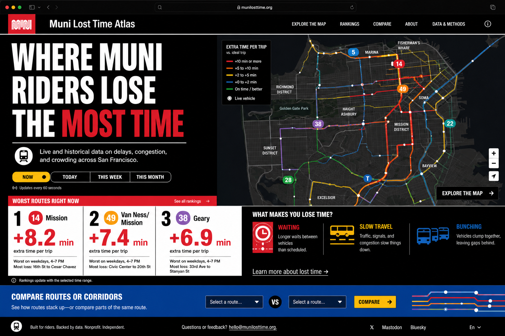
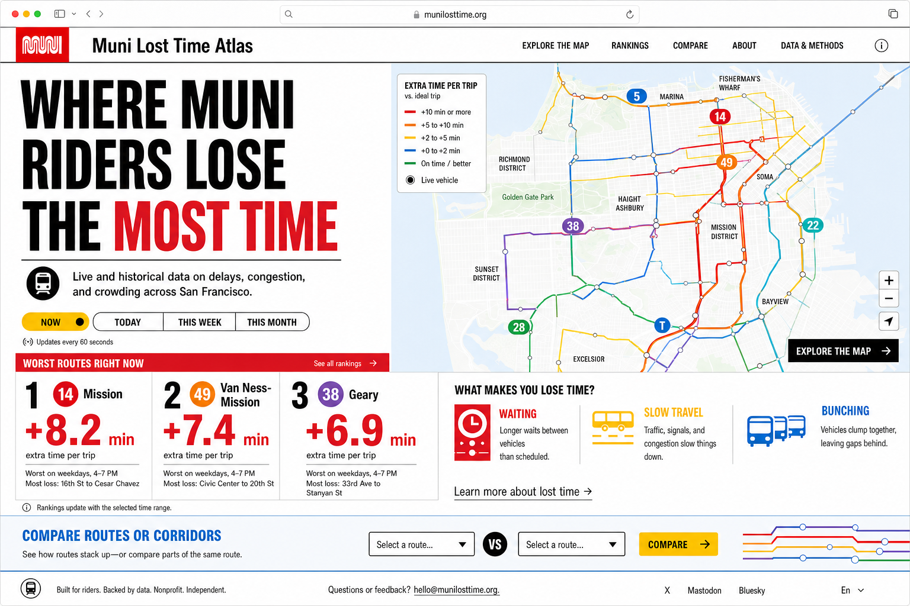

# Muni Lost Time Atlas

## What This Document Is
This document is the non-technical guide for the proposed `Muni Lost Time Atlas` project.

It combines:
- the project thesis
- why it is a good fit for the San Francisco Standard open call
- why it is a strong portfolio signal for transit, GIS, and data / analytics engineering
- what the user should see on the site
- what the MVP should include
- what can be added after MVP
- the rider-facing methodology and math behind the headline metric

This is meant to be the planning source of truth before technical implementation.

## Project Summary
`Muni Lost Time Atlas` is a public-facing interactive site that answers one civic question:

**Where do Muni riders lose the most time, and when?**

The product is designed to avoid becoming a generic dashboard. It should not feel like a spreadsheet with charts attached. It should feel like a sharp public utility for San Francisco that translates transit operations into rider consequences.

The central idea is simple:
- riders lose time before boarding when service is irregular and waits get longer
- riders lose time after boarding when vehicles move more slowly than they should

The site turns those two forms of loss into a public-facing ranking, map, and route explorer.

## Why This Project Fits The Goal
This project is intended to signal:
- `GIS experience`
- `transit interest and fluency`
- `data engineering / analytics engineering capability`
- `full-stack product thinking`

It is also meant to be plausible as a submission to the San Francisco Standard open call:
- the topic is distinctly San Francisco
- it uses public transit data in a way that surfaces a buried public-interest question
- it is not just a repackaging of obvious KPIs
- it can function both as a public-facing interactive and as a strong proposal for a sharper published version

## The Product Thesis
The product should not be framed as:
- slowest buses
- most on-time buses
- a general transit dashboard

The stronger framing is:

**Where Muni riders lose the most time**

That matters because it is:
- more understandable to the public
- more rider-centered than agency jargon
- more editorially interesting
- still grounded in operational metrics transit agencies care about

## What The User Should See
The product should answer these questions in order:
1. `Where are riders losing the most time?`
2. `What kind of time loss is it?`
3. `Where on the route does it happen?`
4. `When does it happen?`
5. `How does this route compare to others?`

The site should therefore be `answer-first`, not `chart-first`.

### The Main User-Facing Metric
The product should lead with one headline number:

**Typical extra time on a full one-way trip**

This is the most honest MVP language because it does not imply a perfect passenger-weighted rider average.

Short UI label:
- `Typical trip: +8.2 min`

Longer UI label:
- `Typical extra time on a full one-way trip`

This number should then be split into:
- `extra waiting time`
- `extra in-vehicle time`

### Homepage Experience
The homepage should immediately show:
- a strong title like `Where Muni Riders Lose the Most Time`
- a short civic subhead
- time toggles like `Now`, `Today`, `This week`, `This month`
- a ranked list of routes with the biggest time losses
- a city map with routes colored by time lost
- a simple explanation of whether the loss comes from waiting, slow travel, or both

Example route card:
- `14 Mission`
- `+8.2 min`
- `extra time per typical full trip`
- `wait +5.1 | travel +3.1`
- `Worst on weekdays, 4-7 PM`
- `Most loss: 16th St to Cesar Chavez`

### Route Detail Experience
When a user clicks a route, they should see:
- the total extra time on a typical full one-way trip
- how much of that comes from waiting
- how much comes from in-vehicle delay
- where on the route the loss is worst
- when during the day the loss is worst
- whether the route is mostly a waiting problem, a slow-travel problem, or both

### Map Experience
The map should not just be live vehicles on a base map.

It should show:
- route corridors colored by the amount of time lost
- optional live vehicle dots
- optional stops overlay
- optional transit-only lane overlay

The route color on the map should represent rider time loss, so the user can look at San Francisco and immediately understand where transit breaks down most.

### Compare Experience
The compare view should let a user compare 2-4 routes and answer:
- which route loses more time
- whether that loss is mostly waiting or onboard delay
- what time window is worst
- which corridor segment is worst

This should feel like a transit story, not a BI table.

## MVP Scope
The recommended scope is a `6-8 week MVP` and a `working prototype + pitch`.

### MVP Includes
- a polished public-facing site
- one strong homepage
- route rankings by time window
- a responsive map
- a route detail view
- a basic compare view
- a methodology page
- real Muni data, not mock data

### MVP Data Scope
- Muni only
- real-time vehicle data for live context
- historical scheduled vs observed data for rankings
- route, stop, and geometry layers
- optional transit-only lane context

### MVP Metrics
Primary:
- `typical extra time on a full one-way trip`

Supporting:
- `extra waiting time`
- `extra in-vehicle time`
- `bunching rate`
- `worst time window`
- `worst segment`

### What To Avoid In MVP
- citywide causal claims about transit-only lanes
- complicated rider-demand modeling
- all Bay Area operators
- a giant analyst-facing dashboard
- too many metrics competing for attention

## Beyond MVP
Possible improvements after MVP:

### Product Improvements
- deeper corridor pages
- stronger mobile polish
- narrative findings on the homepage
- searchable route pages
- shareable route links and image cards

### Analytical Improvements
- richer segment-level travel time modeling
- stronger route-direction normalization
- better handling of short turns
- improved bunching and headway diagnostics
- alternative baselines such as best typical observed runtime

### GIS Improvements
- equity neighborhood overlays
- transit-priority overlays
- stop-level popups
- more precise route segmentation
- street-context annotations

### Data / Analytics Engineering Improvements
- better data quality checks
- more explicit model lineage
- automated backfills
- freshness monitoring
- passenger weighting if a defensible ridership source becomes available

## Visual Direction
The visual language should be:
- punchy
- civic
- flat-color
- typographically strong
- transit-signage inspired

The preferred direction is:
- high-contrast black and white structure
- flat transit colors like red, blue, and yellow
- route-badge accents
- bold sans-serif typography
- sharp blocks and rules rather than soft cards and gradients

The site should feel closer to a transit poster / civic interface than to a startup dashboard.

## Design Mockups
Two homepage mockups were generated during planning.

### Dark Mode Mockup

### Light Mode Mockup

## Data Sources
The project should rely on official and public transit / civic sources where possible.

### Core Transit Sources
- 511 Bay Area transit open data: [https://511.org/open-data/transit](https://511.org/open-data/transit)
- 511 open data FAQ, including historical GTFS and stop observations: [https://511.org/about/faq/open-data](https://511.org/about/faq/open-data)
- SFMTA GTFS transit data page: [https://www.sfmta.com/vi/node/14441](https://www.sfmta.com/vi/node/14441)

### GIS / Civic Context Sources
- Muni Stops dataset: [https://catalog.data.gov/dataset/muni-stops](https://catalog.data.gov/dataset/muni-stops)
- Transit Only Lanes dataset: [https://catalog.data.gov/dataset/transit-only-lanes](https://catalog.data.gov/dataset/transit-only-lanes)
- SFMTA Muni Service Equity Strategy: [https://www.sfmta.com/projects/muni-service-equity-strategy](https://www.sfmta.com/projects/muni-service-equity-strategy)
- SFMTA Transit-First Policy: [https://www.sfmta.com/transit-first-policy](https://www.sfmta.com/transit-first-policy)

### Reporting Context
- SFMTA Muni on-time performance page: [https://www.sfmta.com/reports/muni-time-performance](https://www.sfmta.com/reports/muni-time-performance)

This reporting context matters because SFMTA notes that its old on-time report is offline and that newer reporting is being developed to better combine on-time performance with headway adherence. That supports using a broader reliability framing instead of making simple on-time percentage the lead metric.

## What "Time Lost" Means
The product should define `time lost` as:

**extra minutes a typical full one-way trip loses because service is less dependable than the baseline**

This is made of two parts:
- `extra waiting time`
- `extra in-vehicle travel time`

In plain language:
- riders lose time before boarding when headways are irregular
- riders lose time after boarding when vehicles move more slowly than the baseline trip time

## Headway And Waiting Time Math
The waiting-time side of the project is grounded in standard transit reliability math for random passenger arrivals at frequent service stops.

The TRB paper below cites the classic Welding result:

- Turnquist and Blume, `Evaluating Potential Effectiveness of Headway Control Strategies for Transit Systems`
- [https://onlinepubs.trb.org/Onlinepubs/trr/1980/746/746-005.pdf](https://onlinepubs.trb.org/Onlinepubs/trr/1980/746/746-005.pdf)

The average waiting time is:

`E(W) = E(H)/2 + V(H)/(2E(H))`

Where:
- `W` is wait time
- `H` is headway
- `E(H)` is average headway
- `V(H)` is headway variance

This is equivalent to:

`E(W) = E(H^2)/(2E(H))`

and in sample form:

`E(W) ~= sum(h_i^2) / (2 * sum(h_i))`

This is useful because it shows that:
- average headway matters
- headway variability also matters
- irregular service increases effective wait even if the mean headway looks acceptable

### Waiting Loss
The project should define `extra waiting time` as:

`L_wait = max(0, W_obs - W_base)`

Where:
- `W_obs` is the observed effective average wait time from observed headways
- `W_base` is the baseline expected wait time

For MVP, a reasonable baseline is scheduled headways:

`W_base = W_sched`

So:

`L_wait = max(0, W_obs - W_sched)`

This captures extra pre-boarding time caused by irregular service.

## In-Vehicle Travel Loss Math
The in-vehicle part is conceptually simpler.

For a trip from stop `a` to stop `b` on trip `k`:

`T_obs(k,a,b) = t_obs_arr(k,b) - t_obs_dep(k,a)`

`T_base(k,a,b) = t_base_arr(k,b) - t_base_dep(k,a)`

Then in-vehicle loss is:

`L_veh(k,a,b) = max(0, T_obs(k,a,b) - T_base(k,a,b))`

This means:
- if the bus took longer than baseline, the difference is time lost
- if the bus took less time than baseline, the rider does not "negative lose" time in the public-facing metric

### Baseline Options
Possible baselines:
- `scheduled trip time`
- `best typical observed trip time`
- `dependable route-specific baseline`

For MVP, the cleanest public-facing baseline is:
- `scheduled trip time`

That gives a simple interpretation:
- how much longer did this trip take than the trip implied by the schedule?

### Aggregating Travel Loss
For route-level reporting, a robust aggregate is:

`L_veh(route,W) = median over trips k in W of max(0, T_obs_full(k) - T_base_full(k))`

Where:
- `W` is the selected time window
- `full` means a full one-way trip

Using a median is preferable to a mean for MVP because it is less distorted by extreme outlier trips.

## Combined Typical Trip Metric
The headline route-level metric should be:

`L_typical(route,W) = L_wait(route,W) + L_veh(route,W)`

This represents:

**Typical extra time on a full one-way trip**

This is the cleanest MVP framing because:
- it is rider-relevant
- it is mathematically concrete
- it does not imply perfect passenger weighting

## Passenger Weighting
A passenger-weighted metric is a different claim.

If future data allows weighting by actual rider boardings or trip patterns, the project could move toward:

`L_pax_total = sum over stops s of w_s * L_wait(s) + sum over OD pairs (o,d) of q_(o,d) * L_run(o,d)`

Where:
- `w_s` is the share of riders boarding at stop `s`
- `q_{o,d}` is the share of riders traveling from origin `o` to destination `d`

That is no longer a single-trip metric. It becomes a rider-population average.

So if the product ever uses passenger weighting, the language should change from:
- `Typical trip: +X min`

to something like:
- `Average rider loss: +X min`

For MVP, the single typical-trip framing is reasonable and more defensible.

## Recommended Public Language
Prefer:
- `Typical trip: +8.2 min`
- `Typical extra time on a full one-way trip`
- `Most of that loss comes from waiting`
- `Worst segment: 16th St to Cesar Chavez`

Avoid as the primary homepage language:
- `on-time percentage`
- `schedule deviation index`
- `headway variance`
- `observed/scheduled runtime ratio`

Those can still appear on the methodology page.

## Methodology Summary
Public-facing methodology should explain:

### What The Main Number Means
- The main number estimates how much extra time a typical full one-way trip loses compared with the baseline.

### How It Is Split
- waiting loss comes from irregular or longer-than-expected headways
- in-vehicle loss comes from longer-than-baseline trip times

### Why This Matters
- riders feel unreliable service as extra minutes
- agencies often talk in operations terms, but the public experiences waiting and slow travel
- the product translates system performance into rider consequences

### Caveats
- the MVP headline metric is not a perfect passenger-weighted systemwide rider average
- it is a route-level typical-trip estimate
- direction, short turns, and incomplete observations need careful treatment during implementation

## Frontend Presentation Guidelines
The frontend should present:
- one clear headline metric
- a split between waiting loss and travel loss
- route rankings
- plain-English explanations
- a map colored by time lost
- route-level and segment-level context

The homepage should be ranking-first, not map-first.

The map should be evidence, not the only thing users see.

Every selected route should have a short conclusion such as:
- `Mostly a waiting problem`
- `Mostly a slow-travel problem`
- `A mix of both`

## Proposed MVP Pages
- `Overview`
- `Map`
- `Compare`
- `Methodology`

## Potential TODOs
### Product TODOs
- settle final homepage copy
- decide final title and subtitle language
- define route card component fields
- define route detail page hierarchy
- define compare view hierarchy

### Methodology TODOs
- settle baseline choice for in-vehicle loss
- settle route-level aggregation rules
- define handling for short turns and missing observations
- define route-direction grouping logic
- define chosen time windows for rankings

### Data TODOs
- confirm exact realtime feed structure from 511
- confirm exact historical stop observation fields
- confirm the most stable GIS layers for routes, stops, and transit-only lanes

### Design TODOs
- translate mockup direction into a design system
- define typography, grid, route badges, and map legend treatment
- create mobile-specific wireframes

## Recommended Next Step
The next step after this document is to create the technical implementation plan:
- architecture
- storage model
- ETL / transform flow
- APIs
- frontend component tree
- implementation order

This document should remain the non-technical source of truth for the project concept, user experience, and methodology.
